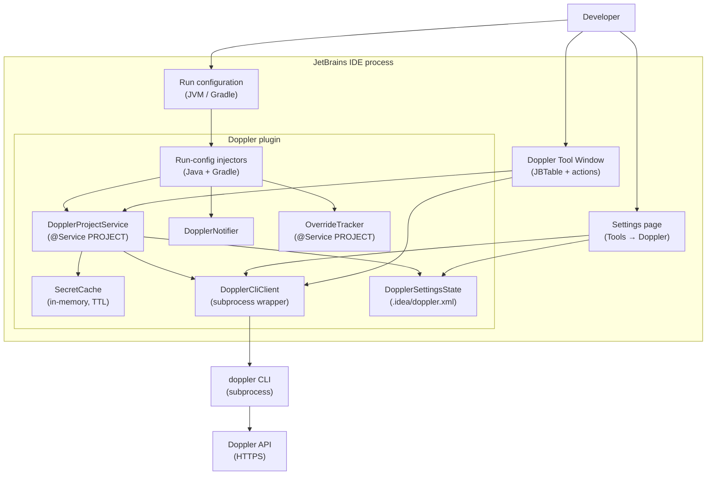
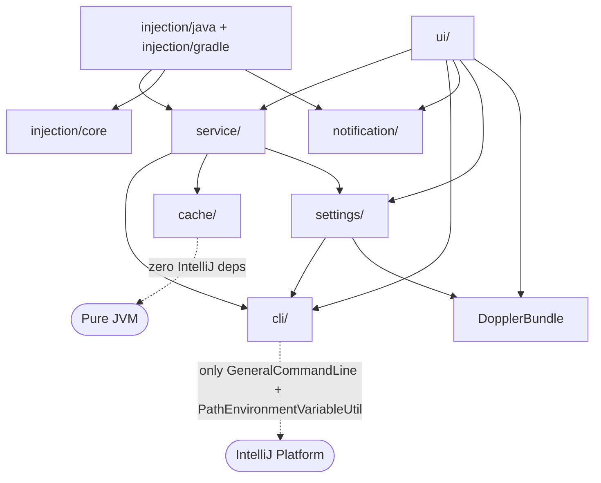
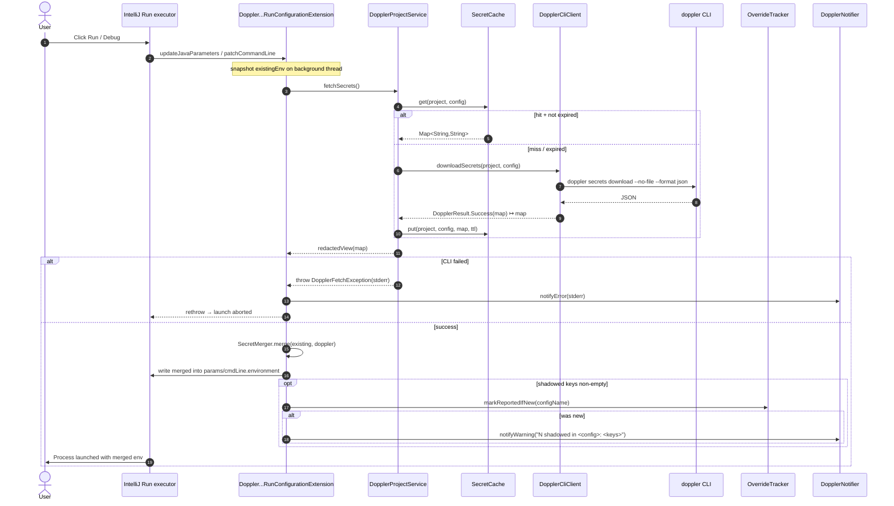
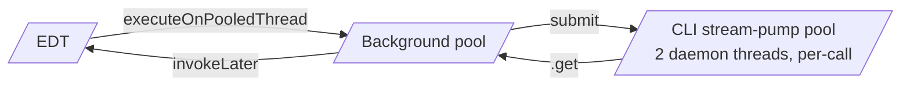
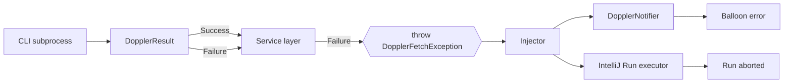
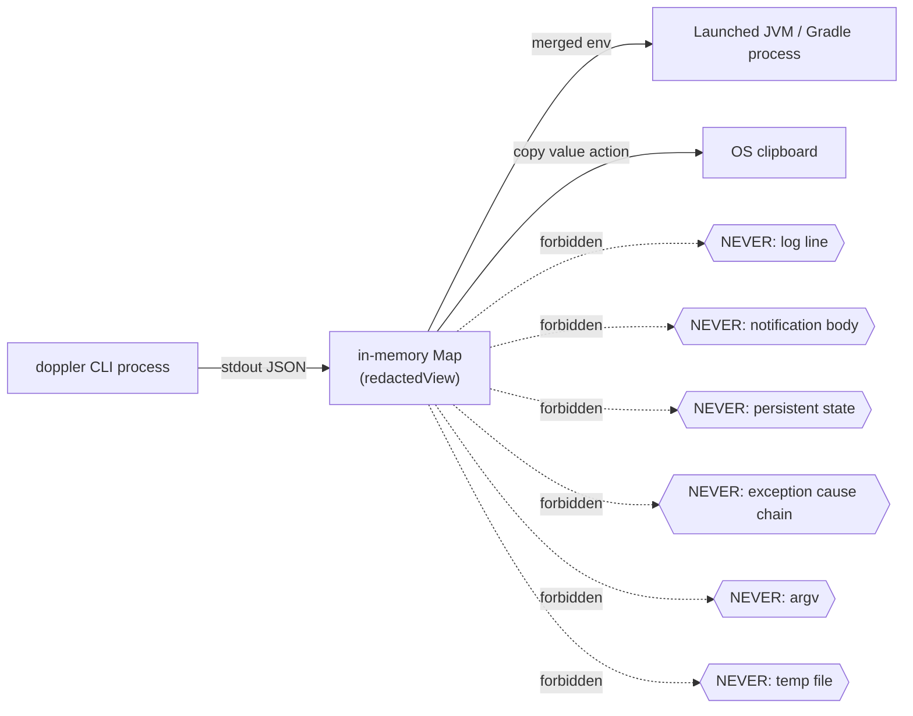

# Architecture

> **Companion documents:** [`spec.md`](spec.md) (what is being built — source of truth),
> [`../AGENTS.md`](../AGENTS.md) (how the codebase is built and reviewed).

This document describes the **current implementation** of the plugin: the modules, the
data flows, the threading model, and the design decisions behind them. When the spec
and the implementation disagree, the spec is updated to match reality and the disagreement
is called out here.

---

## 1. Goals & non-goals

### What the plugin does

- Inject Doppler-managed secrets into JVM and Gradle run configurations at launch time.
- Expose a tool window that lists, copies, edits, adds, and deletes secrets for the
  active Doppler project / config without leaving the IDE.
- Provide a settings page that drives the entire feature from a single place
  (project, config, cache TTL, custom CLI path, connection test).

### What it explicitly does not do (v1)

- No direct calls to the Doppler HTTP API. Every Doppler interaction goes through
  the local `doppler` subprocess.
- No Doppler token storage. The plugin never reads, writes, or transmits tokens.
- No secret-value persistence — anywhere. Not on disk, not in `.idea/`, not in logs,
  not in the IDE's Event Log, not in notification bodies, not in exception messages.
- No per-run-configuration override of project / config (selection is per IDE project).
- No autocomplete / hover enrichment for `System.getenv("FOO")` or equivalents.
- No telemetry.

The full non-goals list is in [`spec.md`](spec.md) §2.

---

## 2. High-level view



The plugin is the *only* tenant of the IDE process that talks to the CLI.
The CLI is the *only* tenant of the host that talks to the Doppler API.

---

## 3. Module layout & dependency rules

```
src/main/kotlin/com/tonihacks/doppler/
├── DopplerBundle.kt              # resource-bundle accessor (i18n)
├── cli/                          # subprocess wrapper, JSON parsing, typed Result
├── cache/                        # in-memory TTL cache
├── service/                      # DopplerProjectService + DopplerFetchException
├── settings/                     # PersistentStateComponent + Configurable + Swing panel
├── injection/
│   ├── core/                     # SecretMerger + OverrideTracker (platform-agnostic)
│   ├── java/                     # JVM family adapter
│   └── gradle/                   # Gradle adapter
├── ui/
│   └── toolwindow/               # tool window factory + Swing panel + actions
└── notification/                 # DopplerNotifier — single notification funnel
```

Layer dependency rules — enforced by code review, not a tool:



Hard rules:

- `ui/` must not be imported by `service/`, `cli/`, `cache/`, or any `injection/`.
- `cli/` only depends on IntelliJ's `GeneralCommandLine` and `PathEnvironmentVariableUtil`.
  Nothing else from the platform.
- `cache/` is pure JVM — it could be moved to a separate Gradle module without changes.
- `injection/core/` is platform-agnostic; family-specific code lives in `injection/java/`
  or `injection/gradle/`. The `service/` layer never imports family-specific types
  (`JavaParameters`, `ExternalSystemRunConfiguration`).

---

## 4. Components

| Component                                                        | Layer            | Responsibility                                                                                                                                                                  | IntelliJ deps |
|------------------------------------------------------------------|------------------|---------------------------------------------------------------------------------------------------------------------------------------------------------------------------------|---------------|
| `DopplerCliClient`                                               | `cli/`           | `version`, `me`, `listProjects`, `listConfigs`, `downloadSecrets`, `setSecret`, `deleteSecret` against the `doppler` subprocess. JSON-decodes responses. Returns `DopplerResult`. | `GeneralCommandLine`, `PathEnvironmentVariableUtil` |
| `DopplerResult` (sealed)                                         | `cli/`           | `Success(value)` / `Failure(error, exitCode)`. `map` / `flatMap` chain operations without exceptions.                                                                            | none |
| `DopplerProject / DopplerConfig / DopplerUser`                   | `cli/`           | Plain data classes for parsed CLI JSON.                                                                                                                                          | none |
| `SecretCache`                                                    | `cache/`         | `ConcurrentHashMap<Pair<String,String>, Entry>` keyed by `(project, config)`. Lazy expiry on read. Per-call TTL override.                                                         | none |
| `DopplerProjectService`                                          | `service/`       | `@Service(PROJECT)`. Single source of truth for "what secrets does this IDE project use?". `fetchSecrets()` is the only public injection entry point.                            | `Service`, `Project`, `RequiresBackgroundThread` |
| `DopplerFetchException`                                          | `service/`       | Carries CLI stderr verbatim across the `service/` → `injection/` boundary. The **only** exception class crossing that boundary.                                                  | none |
| `DopplerSettingsState`                                           | `settings/`      | `PersistentStateComponent<State>` stored in `.idea/doppler.xml`. `enabled`, `dopplerProject`, `dopplerConfig`, `cacheTtlSeconds`, `cliPath`. Redacted `toString()`.               | `Service`, `PersistentStateComponent` |
| `DopplerSettingsConfigurable` + `DopplerSettingsPanel`           | `settings/`      | The Settings → Tools → Doppler page. Async project / config dropdowns. Test-connection button. No project field retained after construction (avoids project-leak detector).      | many (Swing + DSL builder) |
| `SecretMerger`                                                   | `injection/core/`| Pure merge of `(existingEnv, doppler)` → `MergeResult(merged, shadowedKeys)`. Local wins on collision. Returns a `redactedView` of `merged`.                                     | none |
| `OverrideTracker`                                                | `injection/core/`| `@Service(PROJECT)`. Atomic `markReportedIfNew(configName)` so the shadow warning fires once per session per config.                                                              | `Service`, `Project` |
| `DopplerJavaRunConfigurationExtension`                           | `injection/java/`| Subclass of `RunConfigurationExtension`. `updateJavaParameters` → `injectSecrets`.                                                                                                | Java module of the platform |
| `DopplerGradleRunConfigurationExtension`                         | `injection/gradle/`| Subclass of `ExternalSystemRunConfigurationExtension`. `patchCommandLine` → `injectSecrets`. Filters by `GradleConstants.SYSTEM_ID`.                                            | Gradle module of the platform |
| `DopplerToolWindowFactory` + `DopplerToolWindowPanel`            | `ui/toolwindow/` | Right-anchored tool window. JBTable, action toolbar, async load / save / delete / add. Reveal-toggle, copy-value, edit-in-place.                                                  | many |
| `SecretsTableModel` + `SecretRow`                                | `ui/toolwindow/` | `AbstractTableModel`, masking placeholder, redacted `toString` on the row data class.                                                                                              | Swing + bundle |
| `DopplerNotifier`                                                | `notification/`  | The **only** way to surface a balloon. `notifyError / notifyWarning / notifyInfo`. Uses notification group `Doppler` registered with `isLogByDefault="false"`.                  | `NotificationGroupManager` |
| `DopplerBundle`                                                  | top-level        | Resource bundle accessor (`messages.DopplerBundle`). All user-visible strings flow through it.                                                                                    | `DynamicBundle` |

---

## 5. Run-configuration injection model

There is **no single platform-wide hook** for "before any process launches" in IntelliJ.
Each run-configuration family ships its own subclass of `RunConfigurationExtensionBase`.
The plugin handles two families today and is structured so new families add a package
without touching the core service.

### 5.1 Optional plugin dependencies

`plugin.xml` declares two optional fragments. Each fragment is loaded only when its
host plugin is present, so the plugin loads cleanly in IDEs that ship without one
(e.g. PyCharm Community has no Java module).

```xml
<depends optional="true" config-file="doppler-gradle.xml">com.intellij.gradle</depends>
<depends optional="true" config-file="doppler-java.xml">com.intellij.java</depends>
```

`META-INF/doppler-java.xml` registers the JVM extension under
`com.intellij.runConfigurationExtension`.
`META-INF/doppler-gradle.xml` registers the Gradle extension under
`com.intellij.externalSystem.runConfigurationEx`.

### 5.2 JVM family

Covers Application (Java + Kotlin), JUnit, TestNG, Spring Boot — every run configuration
that builds a `JavaParameters` object. The platform routes all of them through the same
hook: `RunConfigurationExtension.updateJavaParameters`.

`isApplicableFor` filters down to `JavaRunConfigurationBase` so the extension is silent
for non-JVM configurations even when the same family extension point fires.

### 5.3 Gradle family

The Gradle integration uses `ExternalSystemRunConfigurationExtension.patchCommandLine`
instead of `updateJavaParameters` because the launched process is Gradle's own daemon
launcher, not a direct JVM. The injector writes into `GeneralCommandLine.environment`
before Gradle starts.

`isApplicableFor` filters by `GradleConstants.SYSTEM_ID` so Maven, npm, and other
external-system configurations that happen to share the extension point are ignored.

### 5.4 Conflict policy

Local wins. If both the run configuration and Doppler define `DATABASE_URL`,
the run configuration's value reaches the process; Doppler is a fallback.

Rationale: during development a programmer wants to point at a personal sandbox
or experiment with a flag without editing the team's Doppler config. The cost is
that a stale local override silently shadows a rotated Doppler secret — `OverrideTracker`
mitigates that by surfacing a warning the first time per session per config the
shadow happens, listing the keys (never the values).

```kotlin
val merged = HashMap<String, String>(existing.size + doppler.size).apply {
    putAll(doppler)
    putAll(existing) // local wins on collision — Doppler is the fallback
}
```

### 5.5 Sequence — secret injection at launch



---

## 6. Threading model

The IntelliJ EDT is sacred. Anything that shells out, hits the network, or does
heavyweight work runs on a background thread; UI updates always cross back through
`ApplicationManager.invokeLater`.



Concrete patterns:

- `DopplerProjectService.fetchSecrets()` is annotated with `@RequiresBackgroundThread`
  so the platform's threading inspection flags any EDT caller.
- `DopplerSettingsPanel.loadProjectsAsync` and `DopplerToolWindowPanel.loadSecretsAsync`
  follow the same shape:
  1. Snapshot every needed Swing-state value on the EDT.
  2. Dispatch to `executeOnPooledThread`.
  3. Run the CLI call (which itself uses a fresh per-call stream-pump executor of
     two daemon threads, **not** `ForkJoinPool.commonPool` — the latter keeps workers
     alive ~60 s and trips IntelliJ's `ThreadLeakTracker`).
  4. Marshal the result back via `invokeLater(..., ModalityState.any())`. Lambdas
     capture only primitives and direct component references — never `this` or
     `Project`, to avoid the project-leak detector.
- `DopplerToolWindowPanel.isLoading` is an EDT-only flag that disables Refresh / Add
  while a fetch is in flight; both completion paths reset it inside `invokeLater`.
- `OverrideTracker` uses `ConcurrentHashMap.newKeySet().add()` so the
  `if (overrides.isNotEmpty() && tracker.markReportedIfNew(name))` pattern is race-free
  even if two threads observe the same configuration concurrently.

`DopplerCliClient.runProcess` deserves a closer look — it is the only place a subprocess
can deadlock or leak:

- stdout / stderr are pumped on a per-invocation `Executors.newFixedThreadPool(2)` whose
  threads are daemon-named `doppler-cli-stream-pump`.
- Timeout (`10 s` default) → `killProcessTree(process)` → SIGKILL the parent **and**
  every descendant captured before the parent died (descendants reparent to launchd /
  init once the parent exits, becoming invisible to `process.descendants()`).
- The `finally` block closes the parent's read pipes (so wedged pumps unblock with
  `IOException`), `shutdownNow`s the pool, and `awaitTermination`s for `STREAM_DRAIN_TIMEOUT_MS`
  (2 s). A wedged pump in uninterruptible native `read()` is logged through JUL.

---

## 7. Caching

- **Key:** `Pair<String, String>` of `(project, config)`. A pair (rather than
  `"$project/$config"`) prevents aliasing if a project name happens to contain `/`.
- **Storage:** `ConcurrentHashMap<Pair<String,String>, Entry>`.
- **Lazy expiry:** entries are not swept on a timer; expiry is checked on `get` and
  the entry is then removed via CAS-style `store.remove(k, entry)` so a concurrent
  re-cache is not clobbered.
- **TTL override per put:** `DopplerProjectService` passes the current settings TTL
  on every cache-miss `put`, so a TTL change in Settings takes effect on the next
  CLI fetch without needing to rebuild the cache.
- **Manual invalidation:** `DopplerProjectService.invalidateCache()` is called by
  the tool window's Refresh / Save / Add / Delete actions — anything that mutates
  remote state.
- **Never persisted, never rehydrated.** A restart of the IDE is a guaranteed
  cache-cold; the first launch of a configuration after restart re-fetches from
  the CLI.

The spec calls for a default TTL of 60 s. The default is encoded in
`DopplerSettingsState.DEFAULT_CACHE_TTL_SECONDS` and `SecretCache.DEFAULT_TTL_MS`.

---

## 8. Error model

The `cli/` layer is exception-free at the boundary: every method returns
`DopplerResult<T>`. The boundary translator
`DopplerCliClient.runProcess` catches *every* exception (`IOException`,
`InterruptedException`, `ExecutionException`, `TimeoutException`,
`CancellationException`, runtime parser issues) and converts to
`DopplerResult.Failure(message, exitCode)`. **Exception messages from third-party
libraries are dropped on the floor**, not forwarded — a future
`kotlinx-serialization` release that includes a "context window" snippet in its
parse-error message would otherwise leak secret bytes via `Result.error → notification`.

The single exception class that crosses the `service/` → `injection/` boundary is
`DopplerFetchException`. Its `message` is the CLI's `stderr.trim()` verbatim. That
boundary exists because the platform contract for `updateJavaParameters` /
`patchCommandLine` is "throw to abort the launch" — there is no `Result` return path.



Rules at the throw-site:

- The injector's `catch (e: DopplerFetchException)` block calls
  `notifyError(project, e.message)` and **rethrows `e` directly** — never wraps in
  `ExecutionException`. A wrapper would smuggle the stderr into the cause chain
  where third-party run listeners and the IDE Run console would surface it via
  `e.toString()` / `e.stackTraceToString()`.

---

## 9. Notifications

There is exactly one notification group, declared in `plugin.xml`:

```xml
<notificationGroup id="Doppler"
                   displayType="BALLOON"
                   isLogByDefault="false"/>
```

`isLogByDefault="false"` is deliberate defence-in-depth: even if a future caller
accidentally passes a value-bearing string into a notification, nothing lingers in
the user's persistent Event Log.

`DopplerNotifier` is the single funnel. Direct use of `Notifications.Bus` or
`new Notification(...)` elsewhere is forbidden by code review.

Notifications fired by the plugin today:

| Trigger                                                | Type    | Body                                                                                          |
|--------------------------------------------------------|---------|-----------------------------------------------------------------------------------------------|
| Injection failed (CLI missing, auth, network, etc.)    | ERROR   | The CLI's stderr verbatim (no value can be in stderr by CLI contract).                        |
| Local env shadows Doppler keys (first time per config) | WARNING | "N Doppler-managed env var(s) are shadowed by local values in `<config>`: <keys>."            |
| Save success in tool window                            | INFO    | "Saved N secret(s) to `<project>/<config>`."                                                  |
| Save / Add / Delete failure in tool window             | ERROR   | "Doppler save failed: `<key>`" — never CLI stderr (which could echo back the value attempted). |
| Delete success                                         | INFO    | "Deleted secret `<key>`."                                                                     |

Where the body is a CLI stderr passthrough, the CLI must guarantee no value content
ends up in stderr. That guarantee is the CLI's contract; the plugin trusts it.
A future hardening pass (planned, see the TODO in `DopplerFetchException`'s KDoc)
would replace that trust with an in-process redactor.

---

## 10. Persistence

```xml
<!-- .idea/doppler.xml -->
<application>
  <component name="DopplerSettings">
    <option name="enabled"           value="true"/>
    <option name="dopplerProject"    value="my-service"/>
    <option name="dopplerConfig"     value="dev"/>
    <option name="cacheTtlSeconds"   value="60"/>
    <option name="cliPath"           value=""/>
  </component>
</application>
```

What is *not* in this file: tokens, secret values, secret names, environment names,
custom branding strings, anything user-identifying. The only project-aware value is
`dopplerProject` / `dopplerConfig` — slugs, not values.

`DopplerSettingsState.State.toString()` is overridden so that even a stray
`log.debug("settings = $settings")` does not print the slugs or the CLI path.

Whether the file is committed is a per-team decision; the plugin works either way.
Committing it gives teammates the same project / config out of the box; gitignoring
it lets each person bind to a personal config.

There is **no** application-level state. The plugin has no global preferences.

---

## 11. Security boundaries



Concrete defences in code:

- `Map<String,String>.redactedView()` decorator (in `DopplerProjectService` and
  `SecretMerger`) overrides `toString` to `"[REDACTED xN]"`.
- `SecretCache.Entry.toString` redacts the entry's secrets.
- `SecretRow.toString`, `SecretsTableModel.toString`, `MergeResult.toString` all
  redact.
- `DopplerSettingsState.State.toString` redacts every field (defensive, even though
  nothing here is a secret value).
- `DopplerCliClient.setSecret` passes the value via stdin
  (`GeneralCommandLine` writes the string to the process input stream, never argv) —
  so values cannot leak via `ps` / `/proc`.
- `DopplerCliClient` parser-error paths drop `IllegalArgumentException.message`
  on the floor and emit a fixed string instead.
- `Result.map` / `Result.flatMap` catch and convert any transform exception into a
  fixed string — never forward a runtime exception's `message`.
- The notification group has `isLogByDefault="false"`.
- The tool window logs only `e.javaClass.simpleName` for fetch-failure messages,
  never `e.message`.

The full per-PR checklist lives in [`../AGENTS.md`](../AGENTS.md) §6.

---

## 12. UI surfaces

### 12.1 Settings page

`Settings → Tools → Doppler`, registered as
`<projectConfigurable parentId="tools" nonDefaultProject="true">`.

Driven by `DopplerSettingsConfigurable` (the IntelliJ contract: `reset` / `isModified` /
`apply` / `disposeUIResources`) and rendered by `DopplerSettingsPanel` (Kotlin DSL +
Swing). The panel does not retain a reference to `Project` after construction — both
the `addBrowseFolderListener` registration and the project-load lambdas use
defensively-snapshotted state to avoid the project-leak detector.

The dropdowns load asynchronously when the panel is shown. If the CLI path field is
empty at panel-open time, the dropdowns stay empty even if the path is filled in
later — the user is expected to *Apply* and reopen the dialog. This is a deliberate
trade-off: re-fetching on every keystroke would mean dozens of CLI subprocess starts.

### 12.2 Tool window

Right-anchored, ID `Doppler`, icon `/icons/dopplerToolWindow.svg` (a 13×13 monochrome
SVG sized per JetBrains UI guidelines; the marketplace `pluginIcon.svg` is the larger
variant).

Layout: `ActionToolbar` on top, `JBScrollPane(JBTable)` in the centre, status label
+ Save button on the bottom.

Actions are `AnAction` subclasses (not plain JButtons) so they integrate with the
platform's enabled-state and theme contract. Each action delegates to an EDT-only
internal method on `DopplerToolWindowPanel`.

### 12.3 Notifications

Covered above (§9).

### 12.4 Status bar widget

Designed in the spec, **not yet implemented**. Resource keys
(`statusbar.text`, `statusbar.off`, `statusbar.no.config`) are present in
`DopplerBundle.properties` so a future widget can plug in without churning translations.

---

## 13. Build & packaging

| Axis                                | Choice                                                                                               |
|-------------------------------------|------------------------------------------------------------------------------------------------------|
| Gradle plugin                       | `org.jetbrains.intellij.platform` 2.16.0 (the new 2.x — the legacy 1.x ID is retired).               |
| Kotlin                              | 2.3.21 (`jvm` + `plugin.serialization`).                                                             |
| JVM target / toolchain              | 21.                                                                                                  |
| Platform baseline                   | IntelliJ Community 2024.2 (`sinceBuild = 242`).                                                      |
| `untilBuild`                        | not set — open-ended compatibility per JetBrains guidance.                                          |
| Plugin ID                           | `com.tonihacks.doppler-intellij`.                                                                    |
| Optional bundled deps               | `com.intellij.gradle`, `com.intellij.java` (loaded by `<depends optional="true">`).                  |
| Runtime dependencies                | `kotlinx-serialization-json` 1.11.0 (only the JSON reader used by the CLI client).                   |
| Test dependencies                   | JUnit 5 (pinned to 5.10.2 for IntelliJ test-framework compatibility), AssertJ 3.27.7, IntelliJ Platform test framework. |
| Static analysis                     | `dev.detekt` 2.0.0-alpha.3.                                                                           |
| Cross-IDE smoke targets             | `runPhpStorm`, `runWebStorm`, `runRider`, `runPyCharm` (registered via `intellijPlatformTesting`).   |
| Signing / publishing env vars       | `CERTIFICATE_CHAIN`, `PRIVATE_KEY`, `PRIVATE_KEY_PASSWORD`, `PUBLISH_TOKEN` (see `docs/SIGNING.md`). |

### 13.1 Common Gradle commands

```bash
./gradlew buildPlugin                  # build/distributions/<id>-<version>.zip
./gradlew test                         # JUnit 5 + IntelliJ test framework
./gradlew detekt                       # static analysis
./gradlew runIde                       # sandboxed IDEA Community 2024.2
./gradlew runWebStorm                  # cross-IDE smoke (also runPyCharm/runPhpStorm/runRider)
./gradlew verifyPluginConfiguration    # platform/SDK config check
./gradlew verifyPlugin                 # plugin.xml + archive structure
./gradlew runPluginVerifier            # JetBrains Plugin Verifier across the IDE matrix
```

### 13.2 Distribution

- **JetBrains Marketplace** — primary distribution channel.
- **GitHub Releases** — signed `.zip` artefacts mirrored for offline installation.
- **Versioning** — SemVer. Pre-1.0 while the v1 acceptance criteria
  (see [`spec.md`](spec.md) §13) are not all green.

---

## 14. Testing strategy

| Layer                             | Tooling                                                | What is asserted                                                                  |
|-----------------------------------|--------------------------------------------------------|-----------------------------------------------------------------------------------|
| `DopplerCliClient`                | JUnit 5, fake shell-script CLI in a temp directory     | All CLI command paths, all error modes, timeout & process-tree kill behaviour.    |
| `SecretCache`                     | JUnit 5, pure JVM                                      | TTL hit, miss, expiry, manual invalidation, concurrent put/get.                   |
| `DopplerProjectService`           | IntelliJ `@TestApplication` + `projectFixture()`       | Settings persistence path, fetch + cache path, redaction, exception throw.        |
| `SecretMerger` / `OverrideTracker`| JUnit 5, pure JVM                                      | Local-wins on collision, shadowed-key set, atomic markReportedIfNew.              |
| Java + Gradle injectors           | JUnit 5 + light fixtures, `injectSecrets` extracted as `internal` for test access | Merge into params/cmdLine, error-rethrow with notification, shadow-warn flow.    |
| Tool window (table model + panel) | JUnit 5, headless Swing                                | Masking, edit-only-when-revealed, save batching, action enabled-state, race guard.|
| Settings panel                    | IntelliJ test fixtures + Swing helpers                 | DSL-builder layout, async-load happy path, no project leak in lambdas.            |

Tests **never** call the real Doppler CLI or API. End-to-end verification (real CLI,
real Doppler workspace, on every supported IDE family) is a manual checklist run
per release.

---

## 15. Open / deferred work

These are deliberate trade-offs documented for whoever picks them up next:

- **`.doppler.yaml` autodetection.** The plugin currently relies on Settings to know
  the project / config. The CLI's project pin file could be parsed at first open.
- **Inject into terminal.** Wrapping the IDE's terminal in `doppler run --` is a one-liner
  conceptually; the wiring (terminal extension API + per-tab flag) is not.
- **Per-run-config override of project / config.** Spec §2 calls this out as a non-goal
  for v1. A clean implementation would add a tab to each run configuration's settings
  via `SettingsEditor`. The default would inherit the project-level pick.

---

## 16. Glossary

- **Doppler project** — a top-level container in Doppler holding one or more configs.
  Identified in the CLI by a slug.
- **Doppler config** — a named environment within a Doppler project (e.g. `dev`, `stg`, `prd`).
  The plugin treats `(project, config)` as a single binding per IDE project.
- **Run configuration** — an IntelliJ object encoding "how to run this thing":
  classpath, JVM args, env vars, working dir, etc. Each family has its own type and
  its own extension point.
- **Run-configuration extension** — a platform-provided hook called before a launch.
  The plugin uses `RunConfigurationExtension` (JVM) and `ExternalSystemRunConfigurationExtension`
  (Gradle).
- **Local-wins** — the merge rule: env vars set on a run configuration shadow Doppler-managed
  values of the same key.
- **Shadowed key** — a key present in both the run configuration's env and the Doppler
  fetch result. Reported once per session per configuration.
- **EDT** — IntelliJ's Event Dispatch Thread. UI work only; never blocking I/O.
