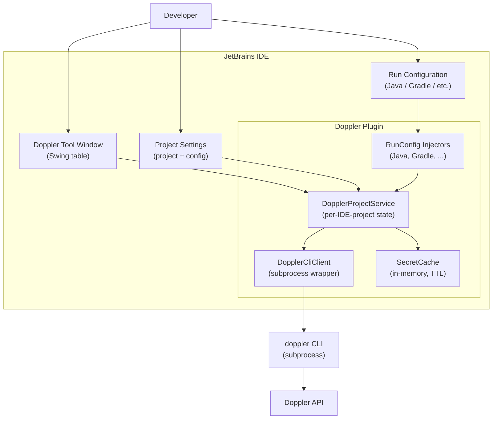
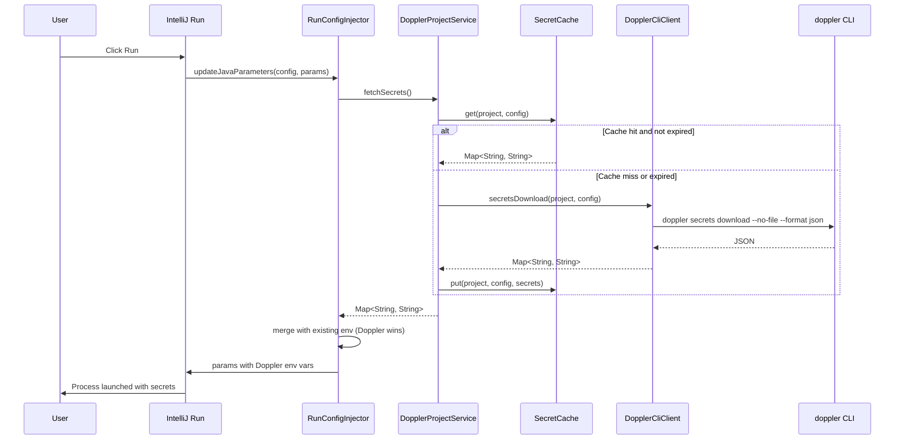

# Doppler JetBrains Plugin — Specification

> **Status:** Draft v1
> **Author:** Toni Masotti
> **Target platforms:** IntelliJ IDEA (Ultimate + Community), WebStorm, PhpStorm, PyCharm, GoLand, RustRover, Rider —
> all on IntelliJ Platform 2024.2+

---

## 1. Goal

Bring the `doppler run --` workflow into the JetBrains IDE family. When a developer presses **Run** or **Debug** on any
run configuration, Doppler-managed secrets are injected as environment variables into the launched process — no manual
command wrapping, no `.env` files on disk.

In addition, provide a tool window that lets developers browse and edit secrets for the project's selected Doppler
config, without leaving the IDE.

## 1a. Reference documentation

The IntelliJ Platform Plugin SDK is the authoritative source. Bookmark these and consult them before inventing anything:

| Topic                                               | URL                                                                                      |
|-----------------------------------------------------|------------------------------------------------------------------------------------------|
| **Quick Start (entry point)**                       | <https://plugins.jetbrains.com/docs/intellij/plugins-quick-start.html>                   |
| Developing a Plugin (overview)                      | <https://plugins.jetbrains.com/docs/intellij/developing-plugins.html>                    |
| Plugin Structure                                    | <https://plugins.jetbrains.com/docs/intellij/plugin-structure.html>                      |
| Plugin Configuration File (`plugin.xml`)            | <https://plugins.jetbrains.com/docs/intellij/plugin-configuration-file.html>             |
| Implementing Plugin in Kotlin                       | <https://plugins.jetbrains.com/docs/intellij/using-kotlin.html>                          |
| **Run Configurations** (architecturally critical)   | <https://plugins.jetbrains.com/docs/intellij/run-configurations.html>                    |
| Run Configurations Tutorial                         | <https://plugins.jetbrains.com/docs/intellij/run-configurations-tutorial.html>           |
| **IntelliJ Platform Gradle Plugin (2.x)**           | <https://plugins.jetbrains.com/docs/intellij/tools-intellij-platform-gradle-plugin.html> |
| **IntelliJ Platform Plugin Template** (CI included) | <https://github.com/JetBrains/intellij-platform-plugin-template>                         |
| Plugin Signing                                      | <https://plugins.jetbrains.com/docs/intellij/plugin-signing.html>                        |
| IDE Development Instance                            | <https://plugins.jetbrains.com/docs/intellij/ide-development-instance.html>              |
| Plugin Development FAQ                              | <https://plugins.jetbrains.com/docs/intellij/faq.html>                                   |
| Doppler CLI reference                               | <https://docs.doppler.com/reference/cli>                                                 |

When the spec and the SDK docs disagree, **the SDK docs win**. Surface the conflict and update the spec.

## 2. Non-goals (v1)

The following are explicitly **out of scope** for v1. They are listed here so they are not silently re-introduced:

- Autocomplete for `process.env.FOO` / `System.getenv("FOO")` / equivalents
- Hover enrichment showing secret values in source code
- Per-run-configuration project/config override (selection is project-level only)
- A custom "Doppler Run" run configuration type
- Doppler CLI bundling or auto-install (CLI is a hard prerequisite)
- Doppler token storage in the plugin (the plugin never touches tokens; the CLI handles auth)
- Multi-config layering / config inheritance UI (the CLI's effective view is what we show)
- Secret value diffing across configs
- Importing/exporting `.env` files
- Webhook/sync triggers for in-IDE refresh on remote changes (manual refresh only)

## 3. Personas

- **Primary:** Backend/full-stack developers using IntelliJ-family IDEs who already use Doppler and currently prefix
  shell commands with `doppler run --`. They want the IDE Run button to "just work."
- **Secondary:** Tech leads / platform engineers who want a low-friction, auditable secrets workflow for their teams
  without `.env` proliferation.

## 4. User stories

### 4.1 Setup

- As a developer, I open an IDE project and the Doppler plugin detects whether the project is Doppler-enabled (via
  `.doppler.yaml` in the workspace root, or via plugin settings).
- As a developer, I can pick a Doppler **project** and **config** for the current IDE project from a single settings
  panel. The selection is persisted per IDE project.
- As a developer, if I have not run `doppler login` yet, the plugin tells me — clearly, with a link to the docs — and
  disables Doppler features until I do.

### 4.2 Secret injection at launch

- As a developer, when I press **Run** or **Debug** on any supported run configuration, Doppler secrets are fetched (or
  read from cache) and merged into the launched process's environment.
- As a developer, if a run configuration manually sets an environment variable that Doppler also provides, **Doppler
  wins** and I get a one-time notification per session telling me which keys were overridden.
- As a developer, if Doppler injection fails (CLI missing, network down, config invalid), I get a clear error in the Run
  output and the launch is **aborted** — never silently launched without secrets.

### 4.3 Secret browsing & editing

- As a developer, I open the **Doppler tool window** and see all secrets for the selected project/config in a table:
  `Name | Value (masked) | Visibility` columns.
- As a developer, I can toggle masking per row, and copy a value to the clipboard.
- As a developer, I can edit a value, add a new secret, or delete a secret. Changes are pushed to Doppler via the CLI on
  save.
- As a developer, I can manually refresh the tool window to fetch the latest secrets from Doppler.

### 4.4 Run config awareness

- As a developer, I see a small Doppler indicator in the run-configuration UI (a status line or icon) showing me which
  Doppler config will be injected, so there's no ambiguity at launch time.
- As a developer, I can disable Doppler injection for the current IDE project from a single toggle (project settings)
  without uninstalling the plugin.

## 5. Architecture

### 5.1 High-level diagram



### 5.2 Components

| Component                                             | Responsibility                                                                                                                                                                                                                                                                                                                          |
|-------------------------------------------------------|-----------------------------------------------------------------------------------------------------------------------------------------------------------------------------------------------------------------------------------------------------------------------------------------------------------------------------------------|
| `DopplerCliClient`                                    | Pure wrapper around the `doppler` CLI subprocess. Knows nothing about IntelliJ. Returns typed results, parses JSON, surfaces errors as typed exceptions. Unit-testable in isolation.                                                                                                                                                    |
| `SecretCache`                                         | In-memory map of `(project, config) → Secrets`. TTL-based (default 60s). Manual `invalidate()` for refresh button. Never persisted.                                                                                                                                                                                                     |
| `DopplerProjectService`                               | IntelliJ `@Service(Service.Level.PROJECT)`. Holds the project-level Doppler selection. Delegates to `DopplerCliClient` and `SecretCache`. Single source of truth for "what secrets does this IDE project use."                                                                                                                          |
| `DopplerSettingsState`                                | `PersistentStateComponent` storing `{ dopplerProject, dopplerConfig, enabled }` per IDE project. Stored under `.idea/doppler.xml` so it can be committed (or gitignored — user choice).                                                                                                                                                 |
| `RunConfigInjector` (per family)                      | Implements the right `RunConfigurationExtensionBase` subclass for that family (e.g., `RunConfigurationExtension` for Java, `PythonRunConfigurationExtension` for Python). There is **no single platform-wide hook**; each family has its own extension point. Calls the project service to get env vars, merges into the launch params. |
| `DopplerToolWindowFactory` + `DopplerToolWindowPanel` | The tool window. Swing-based table, refresh button, edit/save/delete actions.                                                                                                                                                                                                                                                           |
| `DopplerSettingsConfigurable`                         | The settings page under **Settings → Tools → Doppler**. Project picker, config picker, enable toggle, "Test connection" button.                                                                                                                                                                                                         |
| `DopplerNotifier`                                     | Wraps IntelliJ `NotificationGroup` for consistent user-facing messages.                                                                                                                                                                                                                                                                 |

### 5.3 Run-configuration injection model

This is the architecturally critical piece. IntelliJ does not have a single unified hook for "before any process
launches." Each run-configuration family has its own extension point. The plugin's strategy:

1. **Core service** — `DopplerProjectService.fetchSecrets(): Map<String, String>` is platform-agnostic. Every injector
   calls it.
2. **Per-family adapter** — A thin class per run-configuration family that calls the core service and merges secrets
   into that family's parameter object.
3. **Conflict policy** — Doppler keys overwrite manually-set env vars. Overridden keys are collected into a
   session-level `OverrideTracker` and shown once per session via a balloon notification ("Doppler overrode N env vars
   in `<configName>`. Click to see details.").

**v1 ships these adapters:**

| Family                              | Extension point                                                                                                     | Coverage                           |
|-------------------------------------|---------------------------------------------------------------------------------------------------------------------|------------------------------------|
| Java / Kotlin / Spring Boot / JUnit | `RunConfigurationExtension`                                                                                         | IntelliJ IDEA Ultimate + Community |
| Gradle                              | `GradleRunConfigurationExtension` (or generic `RunConfigurationExtension` against `ExternalSystemRunConfiguration`) | All JVM IDEs with Gradle support   |

**v2+ adapters (designed-for, not built):**

| Family                      | Extension point                      | IDEs                    |
|-----------------------------|--------------------------------------|-------------------------|
| Maven                       | `MavenRunConfigurationExtension`     | IDEA, JVM IDEs          |
| Node.js / npm / yarn / pnpm | `NodeJsRunConfigurationExtension`    | WebStorm, IDEA Ultimate |
| Python                      | `PythonRunConfigurationExtension`    | PyCharm, IDEA Ultimate  |
| PHP (built-in, Symfony)     | `PhpRunConfigurationExtension`       | PhpStorm                |
| Go                          | `GoRunConfigurationExtensionBase`    | GoLand                  |
| Rust                        | `CargoCommandConfigurationExtension` | RustRover               |
| .NET                        | (Rider-specific extension points)    | Rider                   |

The core service must remain free of any family-specific imports. Adapters live in optional plugin modules (declared via
`<depends optional="true">` in `plugin.xml`) so the plugin loads cleanly in IDEs that don't have, say, Python support.

### 5.4 Secret fetch flow (sequence)



### 5.5 Failure handling

| Failure                                          | Behavior                                                                                                                        |
|--------------------------------------------------|---------------------------------------------------------------------------------------------------------------------------------|
| `doppler` not on PATH                            | At launch: abort with explicit error in Run output linking to install docs. In tool window: show empty state with install link. |
| `doppler login` not done                         | At launch: abort with explicit error and "Run `doppler login`" hint. In tool window: show login required state.                 |
| Wrong project/config selection (CLI returns 404) | At launch: abort with the CLI's error message verbatim. In tool window: show error and prompt to re-select.                     |
| Network failure                                  | At launch: abort. In tool window: show error, offer manual retry.                                                               |
| Plugin disabled for project                      | Injector becomes a no-op. Run launches normally with no Doppler env.                                                            |

**Principle:** never silently launch a process that *should* have had Doppler secrets but didn't. Failing loudly is a
feature.

## 6. CLI integration

The plugin shells out to the `doppler` CLI. **No direct Doppler API calls in v1.**

### 6.1 Required CLI commands

| Use case                   | Command                                                                                  |
|----------------------------|------------------------------------------------------------------------------------------|
| Verify CLI present         | `doppler --version`                                                                      |
| Verify auth                | `doppler me --json`                                                                      |
| List projects              | `doppler projects --json`                                                                |
| List configs for a project | `doppler configs --project <project> --json`                                             |
| Fetch secrets              | `doppler secrets download --project <project> --config <config> --no-file --format json` |
| Set a secret               | `doppler secrets set <KEY> "<VALUE>" --project <project> --config <config> --silent`     |
| Delete a secret            | `doppler secrets delete <KEY> --project <project> --config <config> --silent --yes`      |

All commands run with a 10s default timeout (configurable). All output is parsed as JSON where supported. stderr is
captured and surfaced verbatim on failure.

### 6.2 Subprocess hygiene

- The plugin uses IntelliJ's `GeneralCommandLine` API (not raw `ProcessBuilder`) for proper IDE-aware process
  management.
- Commands run on a background thread (`backgroundable task`); the EDT is never blocked.
- Secret values passed as CLI arguments (e.g., for `secrets set`) are passed via stdin where possible, never logged. The
  plugin never logs secret values, anywhere, ever — including at TRACE level. There is no debug toggle that bypasses
  this.
- The CLI is resolved via PATH lookup using IntelliJ's `PathEnvironmentVariableUtil`, which is more reliable than a raw
  shell PATH on macOS GUI launches.

## 7. Settings & state

### 7.1 Per-IDE-project state (`PersistentStateComponent`)

Stored at `.idea/doppler.xml`:

```xml

<component name="DopplerSettings">
    <option name="enabled" value="true"/>
    <option name="dopplerProject" value="my-service"/>
    <option name="dopplerConfig" value="dev"/>
    <option name="cacheTtlSeconds" value="60"/>
    <option name="cliPath" value=""/> <!-- empty = PATH lookup -->
</component>
```

Whether `.idea/doppler.xml` is committed is the team's choice. The plugin should encourage committing it (it contains no
secrets — only project/config names) so teammates pick up the same selection automatically.

### 7.2 Application-level state

None in v1. There are no global preferences. Everything is per-IDE-project.

## 8. UI surfaces

### 8.1 Tool window

- Location: right sidebar (default), with a Doppler icon.
- Header: project + config selector dropdowns, refresh button, "+" add secret button.
- Body: scrollable table.
    - Columns: `Name`, `Value`, `Visibility` (masked / shown).
    - Right-click on a row: Copy Name, Copy Value, Reveal/Hide, Delete.
    - Double-click on Value cell: inline edit.
- Footer: status line ("Last refreshed: 12s ago" / "Cache stale, click refresh").

Edit semantics: changes are not auto-saved. The footer shows "N unsaved changes" and a Save button. Save calls
`doppler secrets set` for each changed key (parallel-safe via the CLI). On save success, cache is invalidated and table
is refreshed.

### 8.2 Settings page

**Settings → Tools → Doppler**

- ☐ Enable Doppler injection for this project
- Doppler project: `<dropdown>` (populated from `doppler projects --json`)
- Doppler config: `<dropdown>` (populated from `doppler configs --project=… --json`)
- Cache TTL (seconds): `<number, default 60>`
- Custom CLI path: `<file picker, default empty = use PATH>`
- `[Test connection]` button — runs `doppler me` and shows success/failure.

### 8.3 Notifications

A single `NotificationGroup` named **"Doppler"** with these notifications:

| Event                       | Type        | Content                                                         |
|-----------------------------|-------------|-----------------------------------------------------------------|
| First override of a session | Warning     | "Doppler overrode N env vars in `<configName>`: `<keys>`."      |
| CLI missing                 | Error       | "Doppler CLI not found on PATH. [Install Doppler CLI]"          |
| Auth missing                | Error       | "Doppler not authenticated. Run `doppler login` in a terminal." |
| Save success                | Information | "Saved N secret(s) to `<project>/<config>`."                    |
| Save failure                | Error       | The CLI's stderr, verbatim.                                     |

### 8.4 Status bar widget (v1, light)

A small status bar widget showing `Doppler: <project>/<config>` (or `Doppler: off` when disabled). Click opens the
settings page. This is the primary "what config will be injected" signal at run time.

## 9. Build & distribution

### 9.1 Bootstrap path: use the Plugin Template

**Strongly recommended starting point:** clone or use
the [IntelliJ Platform Plugin Template](https://github.com/JetBrains/intellij-platform-plugin-template). The official
SDK docs recommend it because it ships with required project files **plus a GitHub Actions CI configuration** (build,
verify, release). That removes meaningful setup from this project's scope.

Steps:

1. Use the template via "Use this template" on GitHub.
2. Update `gradle.properties`: `pluginGroup`, `pluginName`, `pluginRepositoryUrl`, `platformVersion`.
3. Replace the boilerplate `MyToolWindowFactory` etc. with the structure in §14.
4. Adapt the GitHub Actions workflows under `.github/workflows/` to the project's release flow.

If the template is intentionally not used, document why in an ADR.

### 9.2 Build configuration

- **Build system:** Gradle (Kotlin DSL) with the [
  `org.jetbrains.intellij.platform`](https://plugins.jetbrains.com/docs/intellij/tools-intellij-platform-gradle-plugin.html)
  Gradle plugin (the new 2.x one — the legacy `gradle-intellij-plugin` 1.x is frozen and must not be used).
- **Plugin ID:** `org.jetbrains.intellij.platform` (note: `org.jetbrains.intellij` is the deprecated 1.x ID).
- **Language:** Kotlin (JVM target 17).
- **Gradle minimum:** 8.13 (required by the platform plugin 2.x).
- **JDK minimum:** 17 (required by the platform plugin 2.x).
- **Platform baseline:** IntelliJ Platform 2024.2 (`sinceBuild = 242`).
- **`untilBuild`:** intentionally **not set**. The SDK docs strongly recommend leaving it open so the plugin works
  against future IDE versions; bumping incompatible versions is handled at the Marketplace level if needed.

### 9.3 Verification

- `verifyPluginConfiguration` — validates SDK/platform/API config (runs locally and in CI).
- `verifyPlugin` — validates `plugin.xml` and archive structure.
- `runPluginVerifier` — runs the official IntelliJ Plugin Verifier against the IDE matrix in §3 personas: IDEA
  Ultimate + Community, WebStorm, PhpStorm, PyCharm, GoLand, on the latest stable + EAP.

### 9.4 Distribution

- JetBrains Marketplace (primary) + GitHub Releases (signed `.zip`).
- **Signing:** plugin signing certificate stored as a GitHub Actions secret.
  See <https://plugins.jetbrains.com/docs/intellij/plugin-signing.html>. The Plugin Template's release workflow already
  wires this — fill in the secrets, don't re-implement it.
- **Versioning:** SemVer. v0.x while pre-stable; v1.0 once core injection + tool window editing are stable across the v1
  IDE matrix.

## 10. Testing strategy

| Layer                   | Tooling                                                              | Coverage target                           |
|-------------------------|----------------------------------------------------------------------|-------------------------------------------|
| `DopplerCliClient`      | Pure JVM unit tests with a fake CLI binary script                    | All CLI command paths, all error modes    |
| `SecretCache`           | Pure JVM unit tests                                                  | TTL behavior, eviction, concurrency       |
| `DopplerProjectService` | IntelliJ `BasePlatformTestCase` with mocked CLI client               | Settings persistence, fetch path          |
| Run-config injectors    | IntelliJ light-test fixtures per family                              | Env var merge, conflict tracking, opt-out |
| Tool window             | IntelliJ test fixtures + Swing test helpers                          | Render, edit, save, refresh               |
| End-to-end              | Manual checklist (in `CONTRIBUTING.md`) using a real Doppler project | Per release, per IDE family               |

There is **no** integration test that hits the real Doppler API. The plugin's only contract with Doppler is the CLI's
output format; we test against fixtures of that output.

## 11. Security considerations

These are non-negotiable:

1. **No secret values touch disk.** Not logs, not temp files, not IDE indexes, not `.idea/`. The injection path is CLI
   stdout → in-memory map → process env, then the map goes out of scope.
2. **No secret values in logs.** Ever. The logger has a hardened formatter that redacts any value that came from the
   secret map. There is no debug flag to bypass this.
3. **No tokens stored.** The plugin never reads, writes, or transmits Doppler tokens. All auth is via the CLI's existing
   keychain integration.
4. **Tool window masks by default.** Values must be explicitly revealed per row; revealing does not persist across IDE
   restarts.
5. **No telemetry.** v1 collects no usage data, no crash reports, no analytics. (If added later, opt-in only, with the
   data shape disclosed in settings.)
6. **Subprocess argument hygiene.** Secret values for `secrets set` are passed via stdin, not argv, so they don't leak
   into `ps`/`/proc`.
7. **Conflict notifications list keys, not values.** "Doppler overrode `DATABASE_URL`" — never the value.

## 12. Open issues / parking lot

These are deliberately deferred. Listed for future-Toni:

- Multi-config layering (e.g., dev + dev_personal). Doppler supports this; the UI doesn't expose it yet.
- Reading `.doppler.yaml` from the workspace to auto-suggest project/config on first open.
- An "inject into terminal" toggle that wraps the IDE's terminal tabs in `doppler run --` automatically.
- Hover enrichment / autocomplete for env var references — gated behind an opt-in setting, off by default, with a clear
  security warning.
- Watching for remote changes (Doppler webhooks → SSE → tool window auto-refresh).
- Bulk import / export from `.env`.
- Diff view between two configs.

## 13. v1 acceptance criteria

The plugin is v1.0-ready when **all** of the following are true:

- [ ] Runs on IntelliJ IDEA (Ultimate + Community) 2024.2+ without errors
- [ ] Runs on WebStorm, PhpStorm, PyCharm, GoLand 2024.2+ without errors (even if family-specific injectors aren't
  built — the plugin shouldn't crash these IDEs)
- [ ] Java/Kotlin run configurations inject Doppler secrets
- [ ] Gradle run configurations inject Doppler secrets
- [ ] JUnit run configurations inject Doppler secrets (covered by Java family)
- [ ] Spring Boot run configurations inject Doppler secrets (covered by Java family)
- [ ] Tool window lists, edits, adds, deletes secrets
- [ ] Settings page persists project + config selection
- [ ] Status bar widget shows current selection
- [ ] All failure modes from §5.5 produce clear, actionable errors
- [ ] No secret value appears in any IDE log at any log level
- [ ] CI pipeline builds + signs + publishes on tag push
- [ ] README has install instructions and a 30-second demo GIF
- [ ] Published to JetBrains Marketplace

## 14. Project layout

```
doppler-jetbrains/
├── build.gradle.kts
├── settings.gradle.kts
├── gradle.properties
├── README.md
├── CHANGELOG.md
├── LICENSE                          # MIT
├── agents.md                        # AI-assistant guidelines
├── spec.md                          # this file
├── src/
│   ├── main/
│   │   ├── kotlin/com/tonihacks/doppler/
│   │   │   ├── cli/                 # DopplerCliClient + types
│   │   │   ├── cache/               # SecretCache
│   │   │   ├── service/             # DopplerProjectService
│   │   │   ├── settings/            # SettingsState + Configurable
│   │   │   ├── injection/
│   │   │   │   ├── core/            # platform-agnostic merge logic
│   │   │   │   ├── java/            # Java/Kotlin/JUnit/Spring injector
│   │   │   │   └── gradle/          # Gradle injector
│   │   │   ├── ui/
│   │   │   │   ├── toolwindow/      # tool window factory + panel
│   │   │   │   └── statusbar/       # status bar widget
│   │   │   └── notification/        # DopplerNotifier
│   │   └── resources/
│   │       ├── META-INF/
│   │       │   ├── plugin.xml
│   │       │   └── pluginIcon.svg
│   │       └── messages/
│   │           └── DopplerBundle.properties
│   └── test/
│       └── kotlin/com/tonihacks/doppler/
│           ├── cli/
│           ├── cache/
│           ├── service/
│           └── injection/
└── .github/
    └── workflows/
        ├── build.yml
        ├── verify.yml
        └── release.yml
```
